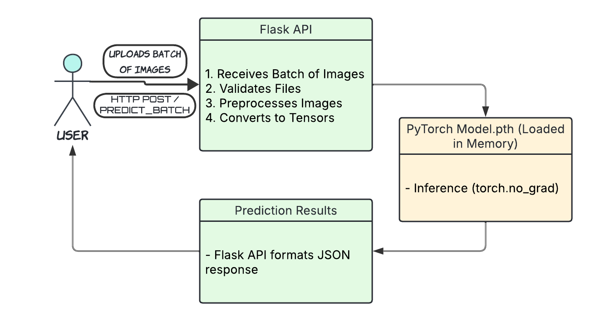

# System Design

The API works next way:

- *User* uploade an image or *batch* of images to the program via **API**
- The program does next:
  1. Receives the Images
  2. Valides them, i.e. checks the format (Only *.png* and *.jpg* are allowed)
  3. Preprocesses the images, i.e.:
     - Resizes them
     - Converts to tensors
     - Normalizes them
- Then the ML model *(Model.pth)*, which is pretrained and loaded in the memory of the program, makes all necessary calculations
- In the final step, the model returns a result ("In a JSON format") to a user via **API**

